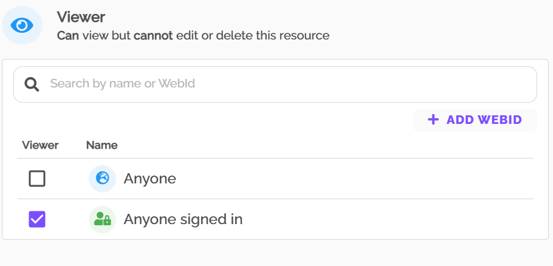
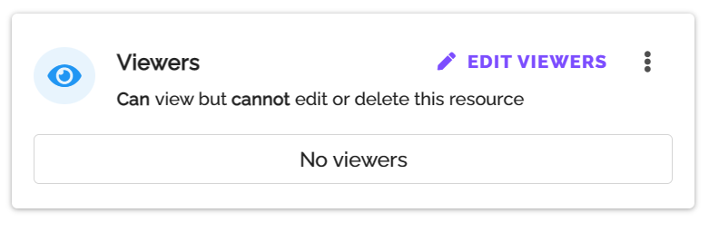
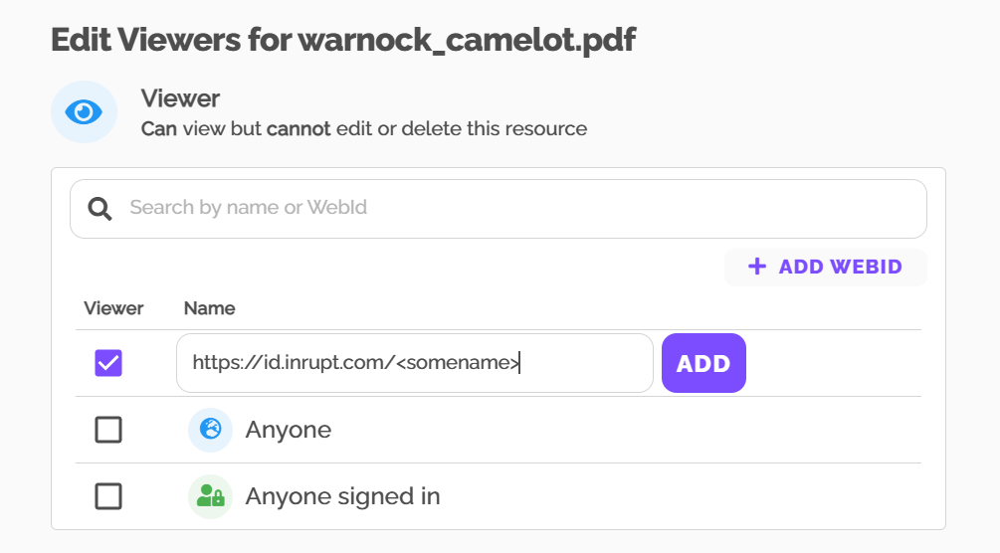

# FileOpen PodViewer Test Instructions

You can test PodViewer in either of two ways: with our PDF or your own.

## Test with our PDF

We have set up a PDF that is provisioned for Anyone Signed in:
 

Clicking the link just below will ask you to sign in and if you do will show you the PDF.
https://solid.fileopen.com/etc.

If you’d like to confirm that the same PDF is not accessible without PodViewer click this link:
https://storage.inrupt.com/etc.

## Test with your own PDF

For this you can use any PDF. If you don’t have one handy you can use this one: [Warnock_camelot.pdf](./files/warnock_camelot.pdf)

First log-in to your PodBrowser and upload the PDF:
 

Then select the file as a Resource:
 

On the right hand side select Viewers and Edit Viewers:
 

Now you can choose to limit access to signed in users or to specific users. 

To add a specific user click + ADD WEBID and paste the WebID into the box. Then save.

 

Now you can get the URI to that PDF from the COPY LINK item:
 

This will put onto your clipboard a URI in this form:
https://storage.inrupt.com/fd59f17b-9142-4adf-98cb-d89418f01879/warnock_camelot.pdf

To open in PodViewer edit the URI by replacing https://storage.inrupt.com/ with https://solid.fileopen.com/

Now copy and paste this URI into your browser.

You can add/remove WebIDs to assign or revoke access.
